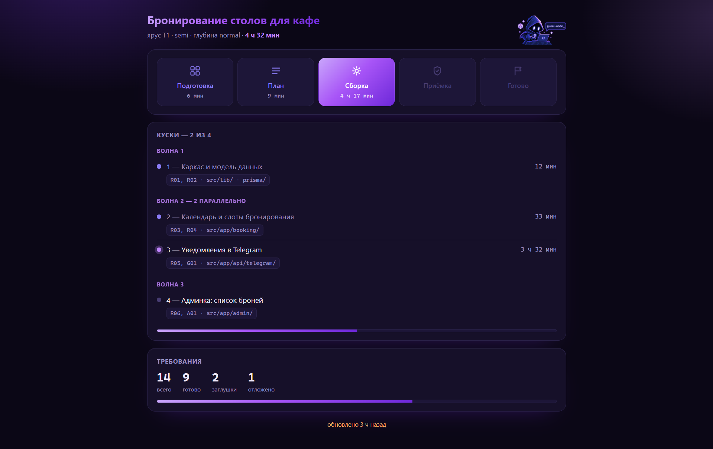

# Gucci Code


Скилл для Claude Code: диктуешь задачу словами — получаешь готовый проект, за один диалог,
без согласований на каждом шаге.

Скилл собран вокруг одной идеи: **ничего из сказанного тобой не теряется молча.** Твои
слова становятся пронумерованным списком требований раньше, чем появится первая строчка
кода, и в конце отдельный проверяющий сверяет собранное с твоим текстом — не с пересказом.

Основная задача — повысить качество конечного продукта за счёт тщательной подготовки, планирования и поэтапной или параллельной сборки с использованием субагентов (при необходимости). На ключевых этапах выполняются проверки и тестирование при оптимальном расходе токенов.



## Что происходит внутри

Четыре этапа. На экране и в отчёте они называются одними и теми же русскими словами —
`Подготовка · План · Сборка · Приёмка · Готово`.

**0. Подготовка.** Смотрит репозиторий и стек, выбирает файл памяти, поднимает дашборд,
объявляет режим одной строкой и сразу идёт дальше — ответа не ждёт.

**1. План.** Записывает твою задачу дословно в `brief.md` — этот файл потом не редактируется
никогда. Разбирает её на пронумерованные требования `R01…Rnn`, каждое с цитатой из твоих слов.
Задаёт вопросы по режиму. Пишет короткую спеку и режет работу на куски с критериями приёмки.

**2. Сборка.** Кусок за куском: написать → запустить → отметить галочку → закоммитить → одна
строка тебе. Крупные куски уходят субагентам, мелкие пишутся на месте.

**3. Приёмка.** Прогоняет тесты, запускает слепую проверку, дописывает память проекта, выдаёт
отчёт.

Всё подчинено дешевизне: 5 файлов, 4 этапа, ~62 000 знаков инструкций за прогон,
субагенты зовутся только там, где без них правда не обойтись.

---

## Установка

Копируется папка `.claude` целиком в корень директории проекта, либо `gucci-code` в глобальную папку скилов Claude —  без `phases/` и `dashboard.html` работать не будет:
файлы этапов читаются по ходу прогона, шаблон дашборда копируется в проект. Вот что внутри
и зачем:

```
gucci-code/
├─ SKILL.md           точка входа — читается при каждом вызове /gucci-code
├─ dashboard.html     шаблон дашборда, Фаза 0 копирует его в .gucci/ проекта
├─ phases/
  ├── 1-plan.md      читается в начале Фазы 1 (План)
  ├── 2-build.md     читается в начале Фазы 2 (Сборка)
  └── 3-final.md     читается в начале Фазы 3 (Приёмка)

```

**Имя папки менять нельзя.** Оно должно совпадать с полем `name: gucci-code` внутри
`SKILL.md`, и по подстроке `gucci` в пути скилл находит свой шаблон дашборда. Переименуешь —
в лучшем случае пропадёт дашборд, в худшем скилл не подхватится вовсе.

Проверить: открой **новую** сессию Claude Code (уже запущенная скиллы не перечитывает) и
набери `/gucci-code` — команда должна появиться в списке.

**Правишь исходники самого скилла?** `/gucci-code` читает установленную копию
(`~/.claude/skills/gucci-code/` или `.claude/skills/gucci-code/`), а не репозиторий, в
котором ты правишь `SKILL.md`. Если это разные папки — правка в репозитории не подействует,
пока не скопируешь её поверх установленной копии.

---

## Как пользоваться

Просто скажи, что построить:

```
/gucci-code сделай телеграм-бота для заявок на ремонт, заявки в гугл-таблицу
```

Дальше вмешиваться не нужно. Скилл сам разберёт задачу, задаст только то, без чего нельзя
начать, соберёт, проверит и напишет отчёт. Ни одной команды запускать не надо.

### Переключатели

Пишутся обычными словами, в любом месте фразы, в любой момент прогона.

| Режим | Как включить | Что спрашивает |
|---|---|---|
| **полный автомат** | «полный автомат», «ничего не спрашивай» | **ничего.** Все развилки закрывает сам и помечает в отчёте как «ПРИНЯТО ЗА ТЕБЯ» |
| **полуавтомат** | *по умолчанию* | только развилки, где два ответа дают **видимо разный продукт** |
| **допрос** | «погриль меня», «допроси» | все настоящие развилки, по одной |

| Глубина | Как включить | Что делает |
|---|---|---|
| **строго** | «строго по брифу», «ничего не добавляй» | ничего сверх сказанного, новые возможности запрещены |
| **обычная** | *по умолчанию* | достраивает очевидное: пустые состояния, ошибки, лимиты |
| **глубоко** | «проработай глубоко», «продумай за меня» | продумывает каждое требование вширь |

Переключить можно на ходу: скажешь «полный автомат» на середине — дальше пойдёт без вопросов,
уже пройденные этапы переигрываться не будут.

---

### Ярусы — сколько кусков резать

Определяется по продукту, а не по длине задачи.

| Ярус | Что это | Кусков | Кто пишет код |
|---|---|---|---|
| **T0** | одна страница, скрипт, форма, один эндпоинт | 1 (вся задача) | сам, одним проходом |
| **T1** | одна связная фича | 2–4 | сам, кусок за куском |
| **T2** | несколько фич или одна через хранение / логику / интерфейс | 5–10 | **субагент на крупный кусок** |

---

## Три проверки, которые нельзя выключить

| Гейт | Когда | Что проверяет |
|---|---|---|
| **G1** | после вопросов | у каждого требования есть статус, ничего не забыто без причины |
| **G2** | после нарезки | каждое требование попало в кусок, **и** каждый кусок ведёт к требованию |
| **G3** | в конце | **слепая приёмка** |

**G3 — то, ради чего всё это.** Отдельный агент получает **только твой исходный текст задачи
и репозиторий** — без плана, без спеки, без списка требований — и говорит, что реально собрано.
Всё до него сверяет сборку с *пересказом* задачи, он один — с самой задачей.

---

## Три правила, которые не нарушаются никогда

1. **Требование снимаешь только ты.** Скилл может отложить и сказать об этом в отчёте, но
   выкинуть — нет. Каждое снятие требует твоей цитаты.
2. **Факты о тебе не выдумываются.** Цены, тексты, адреса, реквизиты остаются видимыми
   заглушками `[ЦЕНА — впиши]`. Придуманная правдоподобная цена хуже пустого места: пустое
   заметят и заполнят, цену — отправят в продакшн.
3. **Ключи не запрашиваются и не пишутся.** Если пришлёшь токен в чате — он будет вырезан из
   файлов, а тебе скажут его отозвать. Необратимое и наружу — деплой, оплата, публикация,
   удаление данных — всегда вопрос, даже в полном автомате.

---

## Что появится в твоём проекте

```
.gucci/
├── brief.md        твои слова дословно. Единственный файл, который видит слепая приёмка
├── plan.md         требования + спека + куски с галочками. Это и есть вид на прогресс
├── state.js        состояние для дашборда
├── dashboard.html  сам дашборд
└── archive/<дата>/ бриф и план предыдущего прогона, если запускаешь второй раз
CLAUDE.md           10–20 строк о проекте, между маркерами gucci-code
```

`.gucci/` коммитится вместе с проектом — это твоя запись о том, что было обещано и что
сдано. Коммит после каждого куска, по путям, **без `git add -A`** — незакоммиченная работа
рядом не заметается.

---

## Дашборд

Открывается сам, один раз, в системном браузере. Показывает пять этапов с часами, список
кусков по волнам (и какие идут параллельно), счётчики требований и результат приёмки —
пропущенные требования красным.

Обновляется сам раз в 10 секунд. **Сервер не нужен** — состояние лежит как `window.STATE`,
и страница подтягивает его тегом `<script>`, который работает и по `file://`.

**Известное ограничение:** внутри панели Claude Code он не тикает — панель отдаёт страницу
как `data:`, и оттуда соседний файл недоступен. Открывай файл в настоящем браузере. Это
осознанный размен: живой дашборд в панели стоил бы отдельного HTTP-сервера, портов и
пид-файлов — примерно четверти всего скилла.

---

## Почему он не зависнет

У каждой петли есть дно, и они собраны в одном месте:

- кусок не прошёл проверку — **2 попытки ремонта**, `BLOCKED` считается попыткой, потом кусок
  помечается сломанным, зависимые от него тоже, работа идёт дальше;
- кусок не влез в контекст — делится **один раз**, не бесконечно;
- гейт не прошёл — этап переделывается **один раз**, дальше нерешённое уходит в отчёт;
- **слепая приёмка запускается ровно один раз за прогон.**

Последнее — главное. Приёмщик не может подтвердить починку: он смотрит на изменившийся
репозиторий и выдаёт *новое мнение*, а не подтверждение. Состояния «да, теперь всё» не
существует, поэтому цикл «агент → приёмщик → агент» не имел бы конца. Починили → доказали
запуском кода → остальное в отчёт.

---

## Сколько это стоит

Инструкции скилла — примерно 15 тысяч токенов на прогон. Основные деньги уходят на субагентов:
**один субагент ≈ 50–90 тысяч токенов.**

- **T0** (скрипт, страница): ~50–60 тысяч — только слепая приёмка.
- **T2** (5+ кусков): ~300 тысяч — 3–4 исполнителя плюс приёмка.

Отсюда правило: субагент зовётся только на T2 или на куске больше ~4 файлов. Всё мельче
пишется на месте — холодный старт агента дороже самой работы.

---

**Прогон прервался** — просто скажи «продолжи». Скилл прочитает `plan.md` и продолжит с
первой незакрытой галочки.

**Второй прогон в том же проекте** — предыдущие `brief.md` и `plan.md` уедут в
`.gucci/archive/<дата>/`, ничего не затрётся.
